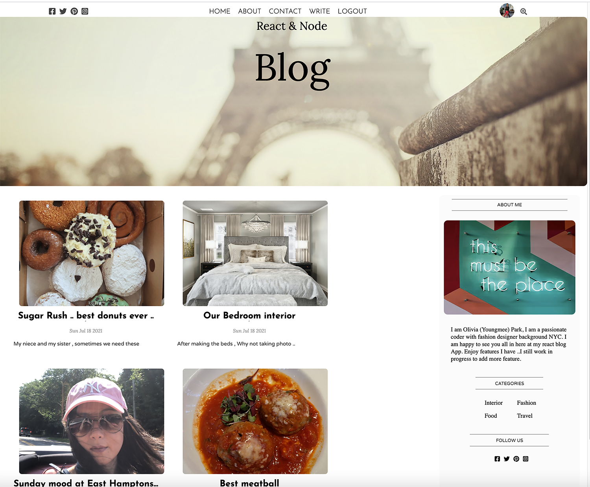
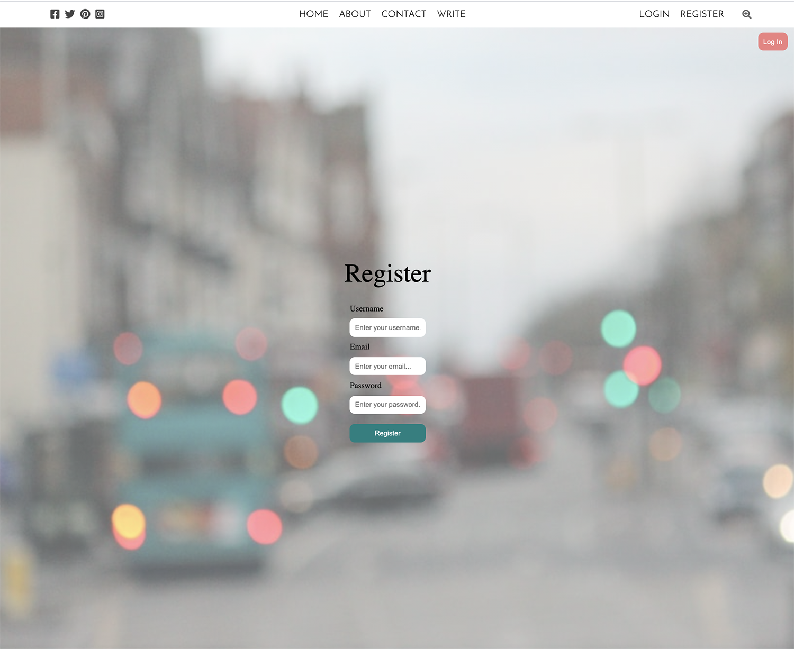
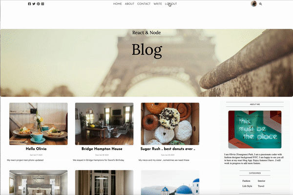
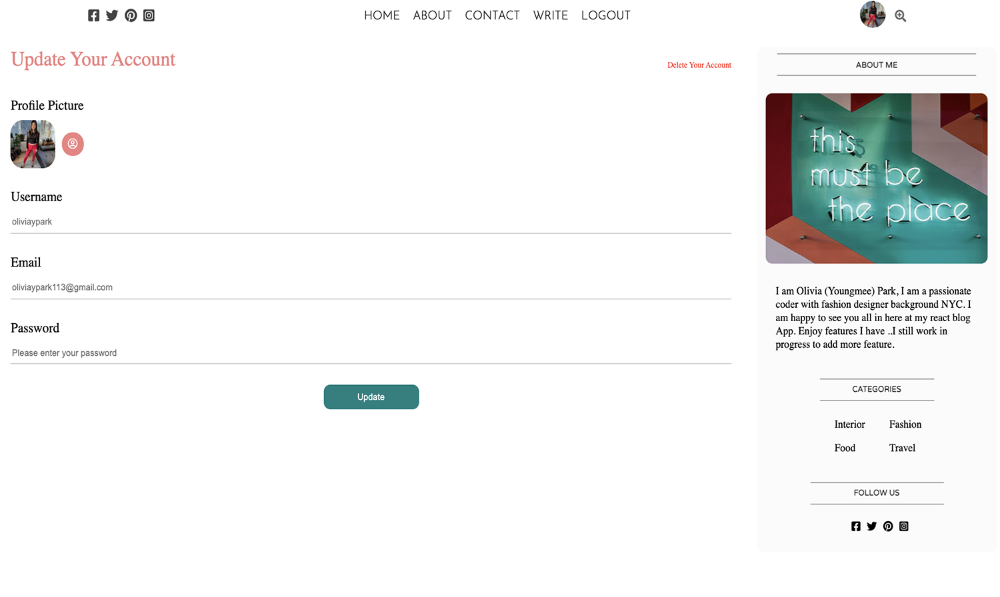
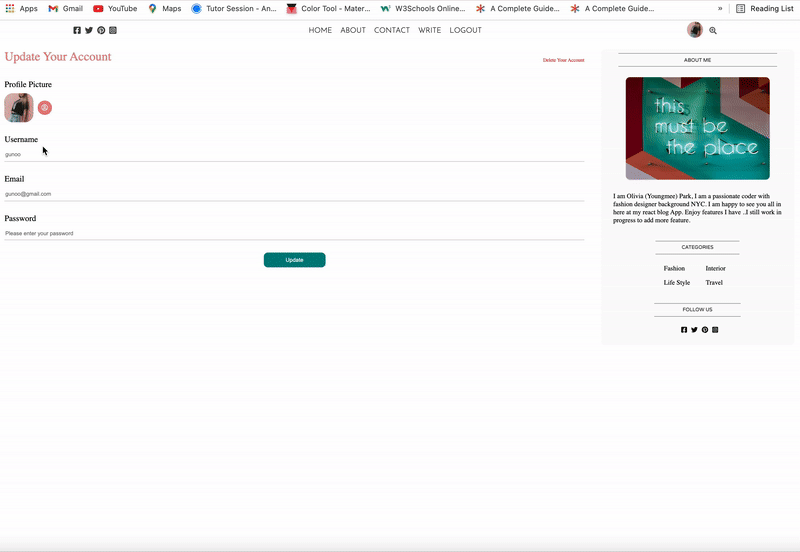

# blog_mern_app

## Links

App deployed link on Heroku
https://agile-everglades-85810.herokuapp.com

## Usage & Features

1. Go to the deployed app website

https://agile-everglades-85810.herokuapp.com

2. Register and directly move to log in page

3. Log in

4. An authentifiacted user can write, upload photos,post images update and delete.

5. If you click <i>TOP LEFT PROFILE PICTIRE<i> it will direct to setting page
   there you can upload your profile picture and infomation.

## Create React App

This project was bootstrapped with [Create React App](https://github.com/facebook/create-react-app).

### Available Scripts

In the project directory, you can run:

## Tech

MERN:

* <a href="https://www.mongodb.com/">MongoDB</a>

* <a href="https://expressjs.com/">Express.js</a>

* <a href="https://reactjs.org/">React.js</a>

* <a href="https://nodejs.org/en/">Node.js</a>

NPM:

`npm i multer`

`npm .dotenv`

#### `npm start`

Runs the app in the development mode.\
Open [http://localhost:3000](http://localhost:3000) to view it in the browser.

## Credits

Lama Dev from Youtube content creator.

## GitHub
https://github.com/Oliviapark113/blog_mern_app